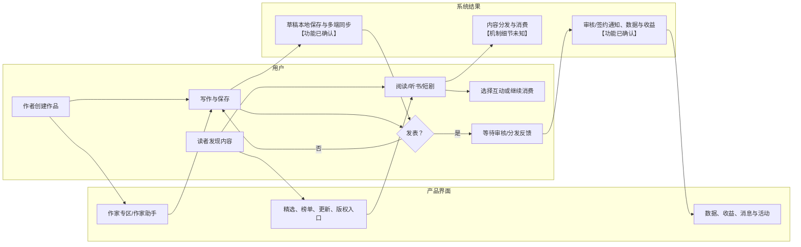
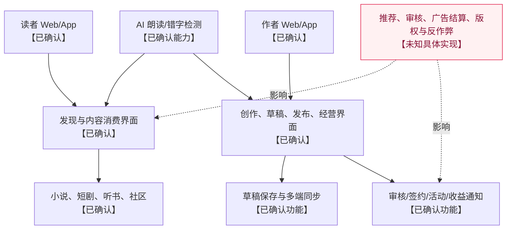

# 番茄小说产品拆解（公开证据版）

更新时间：2026-08-19（Asia/Shanghai）  
范围：仅检查番茄小说官网、官方作家专区入口与 Apple App Store 的官方产品描述；未登录、未阅读全文、未创建作品、未发布章节、未购买会员或触发奖励任务。

## 结论摘要

番茄小说是以免费正版阅读为核心、同时连接读者内容消费、听书/短剧/社区、原创作者创作与作品分发的内容平台。官网能确认发现页的分类精选、榜单、版权改编入口、近期更新，以及作家专区的“创建作品、查看作品数据及收益”；官方 App Store 文案补足了听书、短剧、书圈与创作端的草稿同步、定时发布、错字检测、数据/收益、审核通知等能力。公开材料没有出现可单独识别的 Agent；AI 朗读和 AI 错字检测是能力描述，不能等同为 Agent。

## 证据范围与缺口

| 编号 | 来源 | 直接可见证据 | 不能确认 |
|---|---|---|---|
| FQ-01 | [番茄小说官网](https://fanqienovel.com/) | 作家福利/专区、版权专区、男女频精选、排行榜、近期更新、平台治理公告 | 登录后书架、阅读器、搜索、推荐算法、阅读状态 |
| FQ-02 | [作家专区入口](https://fanqienovel.com/author-helper) | 作家助手与开发主体、协议/隐私入口 | 工作台页面与具体表单 |
| FQ-03 | [番茄小说 App Store 官方页](https://apps.apple.com/cn/app/%E7%95%AA%E8%8C%84%E5%B0%8F%E8%AF%B4-%E7%83%AD%E9%97%A8%E7%9F%AD%E5%89%A7%E5%85%A8%E6%9C%AC%E5%B0%8F%E8%AF%B4%E7%94%B5%E5%AD%90%E4%B9%A6%E9%98%85%E8%AF%BB%E5%99%A8/id1468454200) | 正版免费阅读、短剧、AI 朗读、社区、原创分发与广告+免费模式 | App 内完整路径、广告样式、推荐/审核算法 |
| FQ-04 | [番茄作家助手 App Store 官方页](https://apps.apple.com/cn/app/%E7%95%AA%E8%8C%84%E4%BD%9C%E5%AE%B6%E5%8A%A9%E6%89%8B/id1560557075) | 草稿/多端同步、定时发表、错字检测、数据与收益、审核/签约通知、反馈 | 实际审核时间、收益算法、申诉流程 |

## 用户与商业闭环

| 用户角色 | 核心任务 | 已确认产品反馈 | 平台价值交换 | 证据 |
|---|---|---|---|---|
| 读者 | 发现、阅读、听书、看短剧、参与书圈 | 官网有精选/排行榜/更新/版权改编入口；App Store 列听书、短剧和社区 | 免费正版内容与可选会员/广告+免费模式 | FQ-01、FQ-03 |
| 作者 | 创建作品、写作、保存、发布、看数据与收益 | 作家专区写明创建作品、数据和收益；作家助手列草稿、定时发布、错字检测、统计/收益/通知 | 内容供给、广告分成、活动/全勤/版权等激励 | FQ-01、FQ-04 |
| 平台运营/审核（系统角色） | 内容治理、活动、审核通知、版权运营 | 官网展示违规处罚和低质治理公告；作者端列审核/签约消息 | 【未知】规则执行、人工/自动比例与申诉机制 | FQ-01、FQ-04 |

## 用户旅程证据表：读者侧

| 阶段 | 用户目标与动作 | 页面反馈 | 决策/分支 | 状态/资产变化 | 阻力与未知 | 证据 |
|---|---|---|---|---|---|---|
| 进入发现页 | 浏览男频/女频精选、榜单、近期更新 | 官网列出分类、作品、作者、章节与更新时间 | 选择书籍/版权改编内容 | 【未知】是否记录曝光、兴趣、书架状态 | 推荐排序和搜索行为不可见 | FQ-01 |
| 内容消费 | 阅读正版小说，或进入短剧/听书 | App Store 官方描述有海量正版、短剧、AI 朗读 | 阅读/听书/看剧模式选择 | 【未知】阅读进度、下载、收藏写入 | 阅读器、离线、广告交互未见 | FQ-03 |
| 社区互动 | 在书荒广场、书圈推荐与讨论 | 官方描述明确两类社区 | 参与/不参与讨论 | 社区帖、评论、举报等对象为【合理推断】 | 互动审核、删除和申诉未见 | FQ-03 |
| 付费/会员 | 选择会员服务（如适用） | App Store 写有连续包月 19 元及取消路径 | 开通/续订/取消 | 订阅状态【合理推断】 | 网页与 Android 的定价、权益、退款未知 | FQ-03 |

## 用户旅程证据表：作者侧

| 阶段 | 用户目标与动作 | 页面反馈 | 决策/分支 | 状态/资产变化 | 阻力与未知 | 证据 |
|---|---|---|---|---|---|---|
| 开始创作 | 从作家专区创建作品，使用作家助手写作 | 官网写“创建作品”；App Store 写沉浸写作 | 是否创建/继续草稿 | 作品、草稿是【合理推断】 | 实名、签约和准入要求未以本次页面证实 | FQ-01、FQ-04 |
| 写作与保存 | 编辑内容、保存草稿、跨端同步 | 官方称本地实时保存、手机/电脑多端同步 | 继续修改/定时发表 | 草稿与同步副本【已确认功能描述】 | 冲突合并、断网恢复、版本历史未知 | FQ-04 |
| 文本检查 | 使用错字检测 | 官方称有 AI 专利技术的错字检测 | 接受/忽略修改建议 | 【未知】修改是否自动写入、是否有审校记录 | 误报率、隐私边界与其他 AI 写作能力未知 | FQ-04 |
| 发表与审核 | 定时/即时发表章节，接收审核和签约进度 | 官方列定时发表、审核结果/签约进度通知 | 发表/撤回/修改；通过/不通过 | 章节发布状态、审核通知【合理推断】 | 审核标准、失败信息与申诉入口未见 | FQ-04 |
| 经营与成长 | 查看读完率、流量、互动、广告分成与礼物收益，参与活动 | 官方明确日更数据/收益及活动公告 | 继续创作/参加活动/提现 | 数据看板与收益记录【合理推断】 | 归因、结算周期、提现风控与税务未知 | FQ-01、FQ-04 |

## Agent 与智能能力边界

| 名称 | 页面证据 | 可下的结论 | 不能下的结论 |
|---|---|---|---|
| AI 朗读 | App Store 说明由火山语音团队提供技术支持，并提到多种音色、情感与多角色对话 | 【已确认】存在面向听书的 AI 语音合成能力 | 不能称为“朗读 Agent”，也不能推断模型名称、调用链或训练数据 |
| AI 错字检测 | 作家助手 App Store 说明使用 AI 专利技术进行错字检测 | 【已确认】存在文本检测能力 | 不能确认其是否生成内容、自动改写或充当写作 Agent |
| 推荐、审核、分发系统 | 内容首页、治理公告、审核通知共同表明存在相关产品功能 | 【合理推断】后台存在排序、治理和分发能力 | 无公开证据证明其算法、人工比例、实时性或 Agent 结构 |

因此，本次场景的“实际出现 Agent”清单为：**无可单独识别的 Agent**。AI 能力按系统功能记录，而不是虚构 I/O 契约。

## 数据、资产与状态关系

| 对象（分析名称） | 公开可见内容 | 生产者/消费者 | 证据等级 |
|---|---|---|---|
| 作品/章节 | 官网显示书名、作者、最新章节、更新时间；作者端可创建/发表 | 作者生产、读者消费 | 【已确认/合理推断】 |
| 草稿 | 本地实时保存、手机/电脑同步 | 作者写入、创作端读取 | 【已确认功能描述】 |
| 阅读/听书/短剧内容 | 正版小说、短剧、AI 朗读 | 平台分发、读者消费 | 【已确认】 |
| 作者数据/收益 | 读完率、流量、互动、广告分成、礼物收益 | 平台计算、作者查看 | 【已确认存在看板；未知计算口径】 |
| 审核/签约消息 | 审核结果、签约进度、互动消息 | 平台/运营写入，作者读取 | 【已确认功能描述】 |
| 社区内容 | 书荒广场与书圈 | 用户发布/阅读是【合理推断】 | 【已确认有社区功能】 |

## 架构视图

## 最值得继续验证的五个问题

1. 作者从“创建作品”到章节发布的真实表单、审核状态、拒绝原因、修改和申诉路径是什么？
2. 草稿本地保存与多端同步出现冲突、断网、误删时的版本恢复机制是什么？
3. 推荐、书架、阅读进度、短剧和听书是否共享同一账号与内容状态，还是分别独立？
4. 广告分成、礼物收益、活动奖励及会员收入的归因、结算与可审计明细如何呈现？
5. AI 朗读和错字检测涉及的作品版权、语音/文本处理范围、退出选项与错误修正机制如何向作者和读者透明化？
