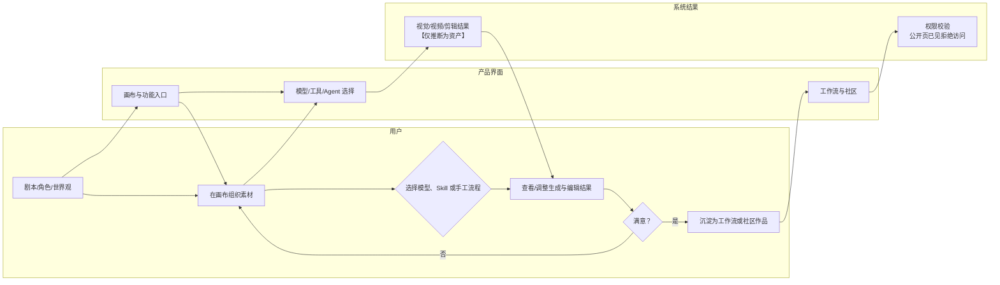
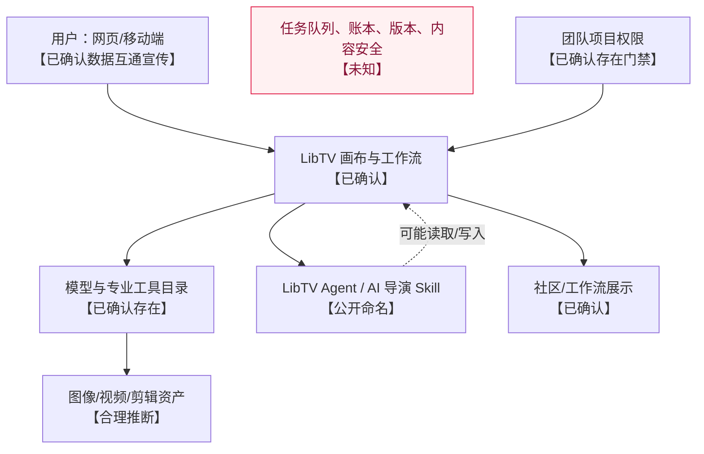

# LibTV 产品拆解（公开证据版）

更新时间：2026-08-19（Asia/Shanghai）  
范围：仅查看 LibTV 非登录公开落地页、社区/画布公开索引与一条公开无权限页面；未注册、未调用模型、未生成或发布作品、未购买会员。

## 结论摘要

LibTV 将自身定位为从生成到剪辑覆盖全链路的专业 AI 视频创作平台。公开页面明确展示“剧本—角色与世界观—无限画布—智能 Agent—工作流/社区”的创作叙事，并宣称聚合 50+ 模型、100+ AI 导演 Skill。能确认其存在画布、模型/工具入口、Agent/Skill 概念、工作流与社区作品分发；无法从公开页确认任一 Agent 的真实输入、工具调用、全局状态或实际视频任务成功率。

## 证据范围与缺口

| 编号 | 来源 | 直接可见证据 | 不能确认 |
|---|---|---|---|
| LT-01 | [LibTV 官方落地页](https://www.liblib.tv/wappro?sourceid=040004) | 登录/注册、模型聚合、智能 Agent、剧本/角色/世界观、画布、工作流、社区、价格宣传 | 登录后实际画布、生成表单、任务状态、扣费与报错 |
| LT-02 | [LibTV 公开画布/社区页](https://kol.liblib.tv/) | 画布入口、Seedance 2.5、片段重拍/锚点锁定、AutoLink、讲解视频自动配画面、混剪、逐帧拉片、LibTV Agent 标题 | 各能力是否默认可用、输入输出、模型路由 |
| LT-03 | [官方公开项目页](https://www.liblib.tv/canvas/share?shareId=zuNWjeShL) | "没有权限访问此项目"、切换团队账户或联系管理员 | 团队角色模型、项目所有权、具体权限矩阵 |

## 核心能力地图

| 能力域 | 页面事实 | 证据等级 | 证据 |
|---|---|---|---|
| 创意前期 | 剧本、角色与世界观创作 | 【已确认】 | LT-01 |
| 创作编排 | 无限画布、自由编排、智能 Agent | 【已确认】 | LT-01 |
| 模型/视频能力 | 50+ 顶尖模型、Seedance 2.5、图生视频、5 分钟原生直出等宣传 | 【已确认其页面展示；未知实际可用范围】 | LT-01、LT-02 |
| 可控编辑 | 片段重拍、锚点锁定重拍、AutoLink | 【已确认其页面展示】 | LT-02 |
| 素材与后期 | 自动配画面、素材混剪、逐帧拉片 | 【已确认其页面展示】 | LT-02 |
| 复用与传播 | 工作流、社区作品/案例 | 【已确认】 | LT-01、LT-02 |
| 端间关系 | 移动端与网页端数据互通；复杂工作流建议网页端完成 | 【已确认】 | LT-01 |

## 用户旅程证据表

| 阶段 | 用户目标与动作 | 页面反馈 | 用户决策 | 页面/资产状态变化 | 阻力/缺口 | 证据 |
|---|---|---|---|---|---|---|
| 发现与注册 | 浏览案例，点击“即刻免费体验”或登录/注册 | 页面主张从生成到剪辑覆盖 | 是否注册/开通会员 | 【未知】账户与默认项目创建 | 未公开注册流程与试用额度 | LT-01 |
| 创建创作空间 | 新建画布，开始组织灵感 | 公开页写“只需一张画布连接多种创意想法” | 选择手工编排或 Skill/Agent | Canvas/Project 作为对象是【合理推断】 | 未见真实画布层级、撤销、自动保存 | LT-01、LT-02 |
| 前期设定 | 输入或组织剧本、角色、世界观 | 页面把三者标为创作起点 | 是否继续生成视觉素材 | 上游文本/参考资产存在【合理推断】 | 未见字段、引用关系和版本规则 | LT-01 |
| 选择生成/编辑能力 | 选择模型或功能，如图生视频、重拍、AutoLink、自动配画面 | 页面呈现多模型与独家工具 | 选择模型、用参考还是重拍 | 生成视频/图片资产存在【合理推断】 | 未见真实参数、等待队列、失败重试和价格结算 | LT-01、LT-02 |
| 画布编排与迭代 | 排列素材、运行工作流或 Agent | 落地页称可自由编排、智能 Agent | 满意/修改/继续下一步 | 节点/连线/引用结构存在【合理推断】 | 未见单个节点失败是否隔离、上游修改是否使下游失效 | LT-01 |
| 复用与分享 | 观看或使用社区工作流/案例 | 公开社区列出创作者、作品与工作流案例 | 是否导入、复制、发布 | 可公开浏览的作品元数据【已确认】 | 有公开项目页面显示“无权限”，权限边界和授权链未知 | LT-02、LT-03 |

## 实际出现的 Agent 与 I/O 契约

### Agent：LibTV Agent（公开命名，能力边界未公开）

1. 核心目标：页面仅以“LibTV Agent”栏目及“智能 Agent 参与视频创作”呈现；可确认它被定位为视频创作助理，不能确认具体任务分工。
2. 触发条件：用户如何唤起、是否自动运行、是否可重复调用均为【未知】。
3. 输入信息：画布内容、脚本、角色、参考素材、用户指令和模型选择均可能相关，但没有公开操作证据；全部为【未知】或【合理推断】。
4. 可观察判断：仅可确认页面宣传 100+ “AI 导演 Skill”；不可把此视为其隐藏思维链或已执行的判断。
5. 调用工具：`组织画布创作（功能命名，并非官方工具名）`、`调用视频模型（功能命名，并非官方工具名）` 均只是能力归纳，非官方函数名，实际调用【未知】。
6. 输出信息：公开可见的是作品案例、工作流和视频相关能力宣传；单次 Agent 输出的文字、节点或资产【未知】。
7. 全局上下文读写：项目/画布、素材、工作流与团队权限很可能存在，但页面未公开数据字段或读写时机。
8. 完成条件：未公开。
9. 异常与重试：仅确认某公开项目会显示“没有权限访问此项目”；模型失败、余额不足、取消/重试界面【未知】。
10. 尚未确认：Agent 清单、每个 Skill 的输入输出契约、工具调用日志、模型路由、成本与验收机制。

### 系统角色：模型与工具目录

官网宣称聚合 50+ 模型与 20+ 独家专业功能，公开画布页列 Seedance 2.5 等功能名称。这支持“存在能力选择层”的结论；不支持“平台自动选择了某模型”“某模型已真正执行”或“所有模型都可用”的结论。

## 数据、资产与权限关系

| 对象（分析名称） | 可确认内容 | 生产者/消费者 | 证据等级 |
|---|---|---|---|
| 画布 | 产品以无限画布、自由编排和“连接创意想法”进行公开描述 | 用户/Agent/工具的实际读写未知 | 【已确认存在概念；未知数据结构】 |
| 剧本、角色、世界观 | 作为创作起点被展示 | 后续模型/Agent 是否读取未知 | 【已确认】 |
| 参考内容关系 | AutoLink 被描述为按参考内容名称和特征自动匹配引用 | 是否稳定 ID、是否可人工覆盖未知 | 【已确认功能宣传】 |
| 视频/图像/剪辑结果 | 功能与社区案例支持资产结果存在 | 文件版本、删除、导出与归属未知 | 【合理推断】 |
| 工作流与社区作品 | 页面展示工作流及大量作品案例 | 复制、授权、收益分配与引用资产权限未知 | 【已确认/未知】 |
| 团队权限 | 无权限页要求切换团队账户或联系管理员 | 角色、审计和外链有效期未知 | 【已确认/未知】 |

## 架构视图

## 最值得继续验证的五个问题

1. 在真实画布中，脚本、角色、参考素材、分镜、视频之间是否是稳定引用，还是只由文本/视觉匹配关联？
2. 各模型的输入限制、分辨率/时长、扣费点、失败原因、取消与退款如何对用户呈现？
3. “LibTV Agent”与 100+ AI 导演 Skill 分别有哪些可见触发条件、输入输出和人工确认节点？
4. AutoLink 的自动匹配是否可编辑、可追溯、可撤销，并会不会错误引用其他资产？
5. 团队权限、工作流复用、社区发布、原始素材和生成结果的版权/访问控制如何落地？
