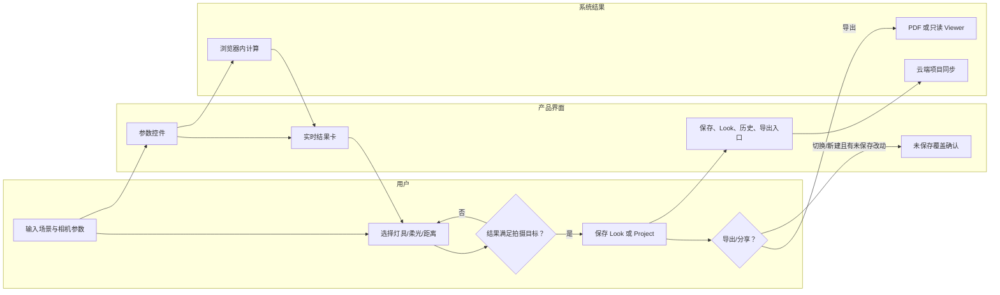
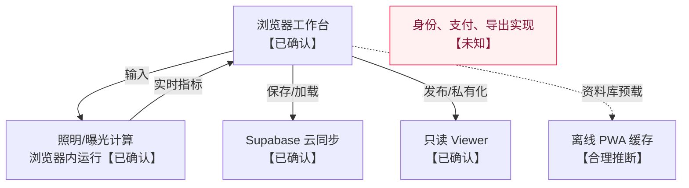

# LightCalc 产品拆解（公开证据版）

更新时间：2026-08-19（Asia/Shanghai）  
范围：仅检查 LightCalc 官网与官方文档的非登录公开内容；未创建账号、未保存项目、未导出、未发布分享链接。

## 结论摘要

LightCalc 是面向摄影指导、灯光师和摄影师的拍摄前照明规划工具：用户输入环境、被摄体、相机、灯具、柔光与距离等变量，页面实时给出照度、T-stop、与环境光的档位差和功耗等结果。其公开文档明确称核心计算在浏览器中运行、已保存项目通过 Supabase 云同步；未见面向用户的 Agent，也没有公开证据支持“AI 自动决策”或隐藏编排。

## 证据范围与缺口

| 编号 | 来源 | 直接可见证据 | 不能确认 |
|---|---|---|---|
| LC-01 | [官网](https://lightcalc.io/) | 实时输出、灯具/柔光资料库、PDF、分享、场景编辑器、套餐文案 | 登录后工作台布局与实际操作记录 |
| LC-02 | [官方文档](https://lightcalc.io/docs) | 输入—计算链、项目/Look/历史/导出/分享/离线说明 | 实际数据库表、API、错误码、计费实现 |

标记：`【已确认】` 为公开页面直接陈述；`【合理推断】` 必须由公开功能关系推导；`【未知】` 表示当前没有页面证据。

## 产品目标与核心对象

| 对象 | 作用 | 证据等级 | 证据 |
|---|---|---|---|
| 现场照明预演 | 在到片场前确定灯具、功率、距离及曝光目标 | 【已确认】 | LC-02：文档称其以预可视化、基于物理的计算替代反复架灯—测光—调整循环 |
| 计算输入 | 环境光、被摄体反射率、ISO/快门/T-stop/ND、灯具、柔光、距离 | 【已确认】 | LC-02："How the Calculation Works" 五步链路 |
| 输出指标 | 被摄体照度、T-stop 等效值、环境光差、功耗等 | 【已确认】 | LC-01：官网列出 Lux、T-stop、Δ vs ambient、Power draw |
| Project / Look / History | 保存完整输入状态、在项目内保存多个 Look、版本回看与恢复 | 【已确认】 | LC-02：Project Management、Looks、Version History |
| Crew-ready 文档 | Dashboard PDF 与 Shoot Plan PDF | 【已确认】 | LC-02：Export 章节 |

## 用户旅程证据表

| 阶段 | 用户目标与动作 | 页面反馈 | 决策/分支 | 状态与资产变化 | 阻力/风险 | 证据 |
|---|---|---|---|---|---|---|
| 进入与试用 | 访问产品并选择免费或付费层级 | 官网呈现 Free、Pro、Plus | 是否升级 | 【未知】是否自动创建默认项目 | 官网与文档的套餐能力有细微差异，需实测核对 | LC-01、LC-02 |
| 设定曝光情境 | 选择/输入环境光、被摄体、相机参数 | 需要照度被计算 | 参数是否足够、是否使用自定义值 | 形成当前未保存的计算状态【合理推断】 | 输入准确性决定输出准确性；产品也明确说不替代现场测光表 | LC-02 |
| 设定灯光方案 | 选择灯具、数量、调光、修饰器/色片、柔光、距离 | 页面随任一输入变化即时更新结果 | 是否达到目标曝光/与环境的关系 | 更新输出与可能的功耗/电路指标 | Free/Pro/Plus 对灯具、调光、双层柔光等有门槛 | LC-01、LC-02 |
| 比较方案 | 保存当前配置为 Look，切换 Look 比较 | 当前 Look 名称与保存提示显示在项目头部（文档描述） | 保留、更新或丢弃当前 Look 的改动 | Look 是项目内完整配置快照 | 未见冲突合并或多人共同编辑说明 | LC-02 |
| 保存与版本回退 | 保存项目、加载/复制/新建、浏览历史 | 文档称保存写入历史条目；替换未保存状态前会提示确认 | 保存/放弃未保存改动；恢复历史/继续编辑 | 已保存项目、版本历史、最近修改时间 | 云端保存/加载要联网；历史容量受套餐限制 | LC-02 |
| 输出协作 | 导出 PDF 或发布只读 Viewer 链接 | Dashboard/Shoot Plan 或可撤销的公开链接 | 是否公开项目；选择导出类型 | PDF 或公共只读链接 | 【未知】导出/发布失败、访问权限和敏感项目披露提示 | LC-02 |
| 离线片场使用 | 安装 PWA 并在联网时预载项目/资料库 | 已加载的数据与计算可离线可用 | 是否启用 Plus/提前缓存 | 本地缓存【合理推断】 | 保存、登录、分享及未缓存资料库仍需网络 | LC-02 |

图注：实线节点均为 LC-02 的公开功能说明；失败、协同冲突和取消后的实际状态未做事实断言。

## 公开可见的系统角色与 Agent 契约

### 角色：照明计算器（系统能力，不命名为 Agent）

1. 核心目标：基于相机与光学输入计算照度和曝光相关指标。【已确认】
2. 触发条件：用户调整任何输入；文档称无需点击 Calculate，输出即时更新。【已确认】
3. 输入信息：环境照度、被摄体、相机、灯具数据、调光、色片、修饰器、柔光与距离。【已确认】
4. 可观察判断：先求所需照度，再按灯具参考照度/调光/修饰器/柔光和反平方律求光到达被摄体后的照度，再比较差值。【已确认】
5. 调用工具：`执行照明与曝光计算（功能命名，并非官方工具名）`；未公开函数或模型名。【已确认其功能，未知其实现】
6. 输出信息：照度、T-stop、差值和功耗等结果卡。【已确认】
7. 全局上下文读写：读取当前计算状态；是否将每次输入写入持久层未知。保存动作才明确产生项目与版本记录。【已确认/未知】
8. 完成条件：页面每次输入变更后给出更新值；没有可见的异步任务完成状态。【已确认】
9. 异常与重试：无公开错误界面证据。【未知】
10. 尚未确认：公式的实现代码、数据校验、边界条件与测试覆盖率。

### 角色：项目同步与分享服务（系统能力）

公开文档明确写明保存项目使用 Supabase 云同步、公开 Viewer 是只读界面、发布后可通过 Make Private 撤销。可观察输入是项目状态和发布操作；输出为保存版本或公开链接。是否存在队列、审核、幂等和访问日志均为【未知】。未见任何命名 Agent。

## 工具、数据与上下文

| 功能工具 | 可见输入/结果 | 结论 | 证据 |
|---|---|---|---|
| 计算引擎（功能命名，并非官方工具名） | 当前输入 → 六类核心输出 | 【已确认】文档称全部输出计算在浏览器运行 | LC-02 |
| 灯具/柔光资料库读取（功能命名，并非官方工具名） | 灯具与柔光选择 | 【已确认】公开套餐与文档均列资料库；具体数据源只称厂商光度数据 | LC-01、LC-02 |
| 项目云同步（功能命名，并非官方工具名） | 已保存项目与跨设备同步 | 【已确认】使用 Supabase 云同步 | LC-02 |
| PDF 导出/公开 Viewer（功能命名，并非官方工具名） | 项目 → PDF 或公开只读页 | 【已确认】功能；文件生成实现未知 | LC-02 |

| 字段/对象（分析名称） | 已确认可表达的内容 | 读写关系 | 证据 |
|---|---|---|---|
| Project | 环境、被摄体、相机、主灯/附加灯、柔光、距离、电路、Look、Crew Notes 等保存状态 | 保存时写入；加载时替换当前状态 | LC-02 |
| Look | 单项目内完整灯光/相机配置快照 | 从当前状态保存；切换时读取并替换当前输入 | LC-02 |
| Version history | 每次保存的历史条目 | 保存产生；历史浏览/恢复读取 | LC-02 |
| Share state | 公共/私有 Viewer 可达性 | Publish 写入，Make Private 撤销 | LC-02 |

## 已确认架构、合理推断与未知

## 值得验证的产品问题

1. 官网 Free 卡写有 PDF Export，而官方文档的功能对比将 Dashboard PDF 列在 Pro、Shoot Plan 列在 Plus；这是公开文案冲突，购买前应以真实工作台为准。
2. 公开证据只描述单项目状态替换和历史回退；多人同时编辑、覆盖冲突、分享链接的权限/过期策略未见说明。
3. 灯具资料来自厂商光度数据，但校准版本、缺失资料的处理及自定义资料审核机制未公开。
4. 离线模式要求预先加载；网络切换中保存失败、缓存失效与恢复机制未见。
5. 结果被定位为拍摄前规划，产品明确提示不能替代现场测光；应避免把计算结果误作实测保证。
