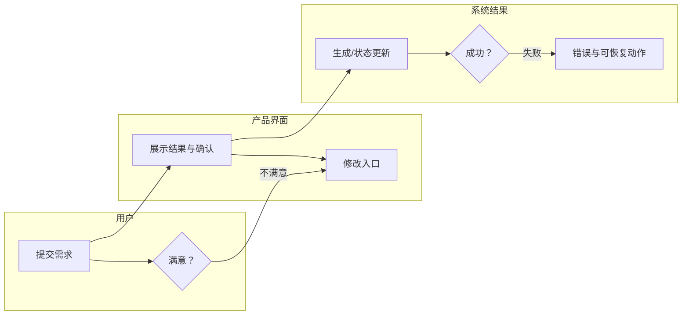
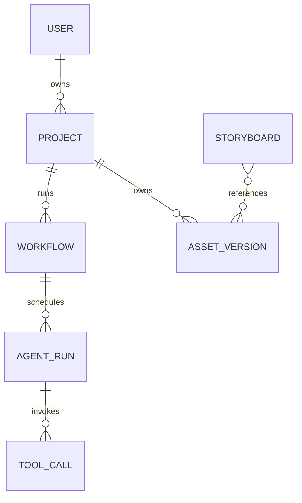

# 证据与输出模板

只在任务需要完整产品拆解、Agent 契约或架构报告时读取本文件。

## 证据台账

| 证据编号 | 来源/时间 | 可见范围 | 直接事实 | 限制/遮挡 | 可支持的问题 |
|---|---|---|---|---|---|
| S01 | 截图 | 聊天/画布/任务 | 页面原文、按钮、卡片、状态 | 滚动外内容不可见 | 用户动作、Agent 公开摘要、资产与状态 |

对同一证据，区分：

- **可见结果**：资产卡、视频、表单值、状态、错误、下载/预览实际结果。
- **可见意图**：Agent 计划、用户提示、按钮文案、未点击菜单。
- **冲突**：两个视图在同一时刻对同一对象给出不一致结果。

不要将“可见意图”升级为“可见结果”。

先实际检查每张原始截图的可见像素，必要时放大局部；目录名、截图名、CSV 整理注释和旧报告只可用于索引，不能替代页面事实。

## 用户旅程模板

| 阶段 | 用户目标 | 用户动作 | 页面反馈 | 用户决策 | 页面/资产变化 | 阻力 | 证据 |
|---|---|---|---|---|---|---|---|

泳道图最低要求：



## Agent 清单与 I/O 契约模板

先列清单：

| Agent/系统角色 | 首次可见 | 触发者 | 上游 | 下游 | 是否重入 | 证据 |
|---|---|---|---|---|---|---|

每个 Agent 卡使用：

```text
Agent：名称
1. 核心目标
2. 触发条件
3. 输入信息
   - 用户当前输入：
   - 用户长期信息：
   - 项目全局上下文：
   - 上游 Agent 输出：
   - 平台公共资产：
   - 工具或运行时结果：
4. 可观察判断
5. 调用工具（功能命名，并非官方工具名）
6. 输出信息
7. 全局上下文读写
8. 完成条件
9. 异常与重试
10. 尚未确认的问题
```

全局上下文读写表：

| 字段/对象 | 读取/写入 | 生产者 | 消费者 | 更新时机 | 证据等级 | 证据 |
|---|---|---|---|---|---|---|

## 完整架构报告章节

1. 一句话执行摘要
2. 证据来源与缺口
3. 核心功能域
4. 五条流并列的端到端表
5. 分层架构
6. Agent、工具和全局上下文关系
7. 全局上下文架构
8. 知识与公共资产架构
9. 模型接入与路由架构
10. 技术能力选型表
11. 数据实体表和 ER 图
12. 时序图
13. 产品全景图
14. As-Is
15. To-Be
16. 风险
17. 组件—证据追溯
18. 待验证问题

端到端表的固定列：

| 步骤/触发 | 用户交互流 | Agent 控制流 | 工具调用流 | 数据/上下文流 | 资产流 | 确认/失败分支 | 证据 |
|---|---|---|---|---|---|---|---|

分层表的固定列：

| 层级 | 已确认 | 合理推断 | 建议设计 | 未知/不能确认原因 |
|---|---|---|---|---|

## 图的规则

### 数据实体图

实体名称只是分析模板。不要说页面已证明某张表存在。

最低检查项：`User`、`Project`、`Conversation`、`Agent`、`AgentRun`、`Workflow`、`Task`、`ToolCall`、`Script`、`Character`、`Scene`、`Prop`、`Storyboard`、`Asset`、`AssetVersion`、`UserConfirmation`、`ModelInvocation`、`Error`、`BillingRecord`、`Feedback`。



### 时序图

使用真实出现的参与者；若某参与者是建议组件，在名称里标 `建议`。必须呈现输入、确认、异步等待、资产写回、修改、失败、中断和下游交接。示例中的“角色参考图”不能当作当前产品一定支持。

### 全景图

从上到下画：用户与渠道 → 工作台 → 应用 → Agent/编排 → 工具/服务 → 模型 → 上下文数据 → 知识/基础设施。每条边标注 `调用`、`读取`、`写入`、`事件`、`确认`、`资产引用` 或 `状态更新`。保持下列图例：

- 实线：已确认
- 虚线：合理推断
- 点线或特殊色：建议设计
- 红色/警示节点：已确认问题或明确未知的关键控制点

## 架构建议的最低质量线

当页面出现状态、资产或任务不一致时，建议架构至少应说明：

1. 一个可审计的 `WorkflowState` 事实源。
2. 不可变 `AssetVersion` 和显式 `DependencyEdge`。
3. AgentRun 与 ToolCall 的输入/输出快照、幂等键、取消和重试语义。
4. 提交前额度预估/冻结，回调结算/退款，不允许 Agent 文本绕过账本。
5. 安全、版权、权限和导出策略在服务/工具层强制执行。
6. 上游修改导致下游 `stale`，由用户选择局部重算。
7. 交付门校验资产完成度、时长、质量与安全；预览草稿和正式导出必须区分。
