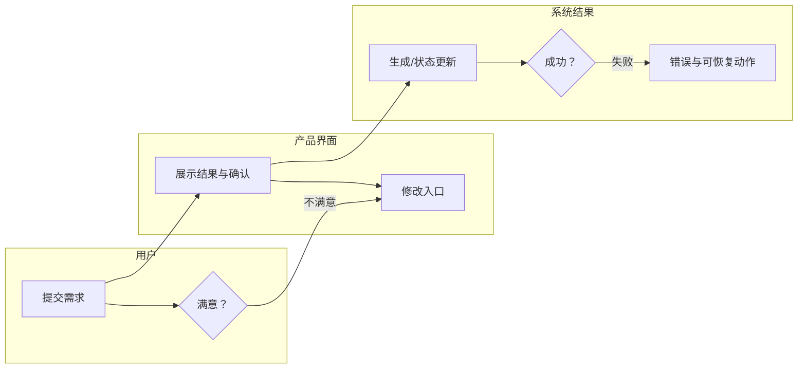
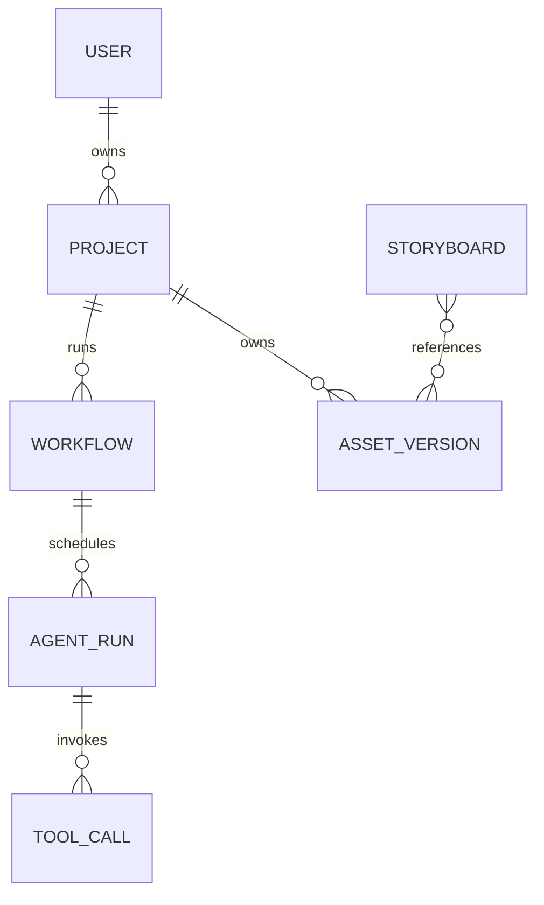

# 证据、测试与输出模板

只在任务需要完整产品拆解、体验评分、Agent 契约或架构报告时读取本文件。以下字段名、流程和评分权重均为分析模板；只有原始页面/官方资料支持时，才可写成被拆产品事实。

## 1. 证据与假设台账

| 证据编号 | 来源/时间 | 可见范围 | 直接事实 | 限制/遮挡 | 可支持的问题 |
|---|---|---|---|---|---|
| S01 | 截图 | 聊天/画布/任务 | 页面原文、按钮、卡片、状态 | 滚动外内容不可见 | 用户动作、公开摘要、资产与状态 |

| 假设/建议编号 | 类型 | 依据 | 替代解释/风险 | 下一步验证 |
|---|---|---|---|---|
| H01 | 合理推断/建议设计 | 列出相关证据 | 不确定性 | 所需页面、日志或官方资料 |

对同一证据区分：

- **可见结果**：资产卡、视频、表单值、状态、错误、下载/预览实际结果。
- **可见意图**：Agent 计划、用户提示、按钮文案、未点击菜单。
- **冲突**：两个视图在同一时刻对同一对象给出不一致结果。

不要将“可见意图”升级为“可见结果”。先实际检查每张原始截图的可见像素；目录名、截图名、CSV 注释和旧报告只可用于索引，不能替代页面事实。

## 2. 测试卡与评分卡

### 测试卡

| 项目 | 记录内容 | 证据 |
|---|---|---|
| 目标用户/待完成任务 | 原始需求、用户目标 | |
| 入口与模式 | 起始页、对话/工作台/自动模式 | |
| 控制输入 | 风格、时长、比例、素材、语言、模型等 | |
| 关键检查点 | 确认、可编辑、生成、预览、导出、错误 | |
| 成功判定 | 什么可见交付物满足任务 | |
| 可见失败/中断路径 | 错误、取消、余额、返回、重试 | |
| 范围限制 | 未覆盖的用户、路径、设备或时间 | |

### 可调整评分卡

只有用户要求评分或比较时使用。预设权重可调整，且必须显示调整理由。

| 维度 | 默认权重 | 可观察检查项 | 分数/未评分 | 证据与理由 |
|---|---:|---|---|---|
| 端到端交付 | 40% | 从需求到可验证交付物、失败恢复 | | |
| 用户共创与可控性 | 20% | 确认、编辑、回退、局部重做、进度可见性 | | |
| Agent/流程协同 | 25% | 可见角色、交接、状态一致、依赖与重入 | | |
| 模型/数据/资产基础 | 15% | 素材复用、引用关系、模型可见性、资产版本 | | |

未看到足够证据时写“未评分”，不能把未知折算为 0 分或产品缺陷。

## 3. 用户旅程模板

| 阶段 | 用户目标 | 用户动作 | 页面反馈 | 用户决策 | 页面/资产变化 | 阻力/情绪 | 证据 |
|---|---|---|---|---|---|---|---|

泳道图最低要求：



## 4. Agent 清单、I/O 契约与工具表

先列清单：

| Agent/系统角色 | 首次可见 | 触发者 | 上游 | 下游 | 是否重入 | 工作模式 | 证据 |
|---|---|---|---|---|---|---|---|

每个 Agent 卡：

```text
Agent：名称
1. 核心目标
2. 触发条件
3. 输入信息
   - 用户当前输入：
   - 用户长期信息：
   - 项目全局上下文：
   - 上游 Agent 输出：
   - 平台公共资产：
   - 工具或运行时结果：
4. 可观察判断
5. 调用工具（功能命名，并非官方工具名）
6. 输出信息
7. 全局上下文读写
8. 完成条件
9. 异常与重试
10. 尚未确认的问题
```

工具表：

| 工具/功能名称 | 关联 Agent | 可见输入 | 可见结果 | 执行结论 | 证据 |
|---|---|---|---|---|---|

使用“读取项目上下文”“更新角色信息”“生成角色主图”“建立分镜引用”“生成视频”“检查余额”等功能名时，注明并非官方工具名。将“Agent 说要调用”标为“仅计划”，不标为已执行。

## 5. 全局上下文、资产与状态模板

### 上下文读写/数据传递表

| 字段/对象 | 读取/写入 | 生产者 | 消费者 | 更新时机 | 稳定引用/版本 | 证据等级 | 证据 |
|---|---|---|---|---|---|---|---|

优先查找下列对象是否有页面证据：项目元数据、Brief/Script、角色/场景/道具库、分镜、资产及版本、任务/工作流、确认、计费、错误/事件。不可见的 `project_id`、URI、主键、表名或存储结构不能编造。

### 建议的状态一致性检查（不是事实）

| 风险 | 应检查的事实 | 可能的建议设计 |
|---|---|---|
| 聊天说完成但画布未完成 | 同一资产/任务在各视图的状态和时间 | 单一 `WorkflowState` 事实源及状态快照 |
| 上游修改后下游仍展示旧结果 | 修改时间、版本、引用、重生成提示 | 不可变资产版本、依赖边和 `stale` 标记 |
| 重试/取消重复执行 | 重试按钮、任务编号、余额变化、输出数量 | 幂等键、取消语义、可审计 AgentRun/ToolCall |
| 额度文字与实际扣费不一致 | 价格、余额、失败/退款提示 | 预估/冻结/结算账本与服务端强制校验 |

## 6. 完整架构报告章节

1. 一句话执行摘要
2. 证据来源、测试范围与缺口
3. 产品定位、目标用户、核心交付物与功能域
4. 用户旅程、体验问题、评分（如适用）
5. 五条流并列的端到端表
6. 分层架构
7. Agent、工具、全局上下文、资产与数据生产者—消费者关系
8. 知识与公共资产架构
9. 模型接入与路由架构
10. 技术能力选型表
11. 数据实体表和 ER 图
12. 时序图
13. 产品全景图
14. As-Is
15. To-Be
16. 风险、机会点与验证计划
17. 组件—证据追溯
18. 待验证问题

端到端表固定列：

| 步骤/触发 | 用户交互流 | Agent/流程控制流 | 工具调用流 | 数据/上下文流 | 资产流 | 确认/失败分支 | 证据 |
|---|---|---|---|---|---|---|---|

分层表固定列：

| 层级 | 已确认 | 合理推断 | 建议设计 | 未知/不能确认原因 |
|---|---|---|---|---|

## 7. 图的规则

### 数据实体图

实体名称只是分析模板。不要说页面已证明某张表存在。

最低检查项：`User`、`Project`、`Conversation`、`Agent`、`AgentRun`、`Workflow`、`Task`、`ToolCall`、`Script`、`Character`、`Scene`、`Prop`、`Storyboard`、`Asset`、`AssetVersion`、`UserConfirmation`、`ModelInvocation`、`Error`、`BillingRecord`、`Feedback`。



### 时序与全景图

使用真实出现的参与者；若某参与者是建议组件，在名称里标“建议”。必须呈现输入、确认、异步等待、资产写回、修改、失败、中断和下游交接。全景图从上到下画：用户与渠道 → 工作台 → 应用 → Agent/编排 → 工具/服务 → 模型 → 上下文数据 → 知识/基础设施。

- 实线：已确认
- 虚线：合理推断
- 点线或特殊色：建议设计
- 红色/警示节点：已确认问题或明确未知的关键控制点

每条边标注“调用”“读取”“写入”“事件”“确认”“资产引用”或“状态更新”。

## 8. 架构建议的最低质量线

当页面出现状态、资产或任务不一致时，建议架构至少应说明：

1. 可审计的工作流状态事实源。
2. 不可变资产版本与显式依赖关系。
3. Agent/工具运行的输入输出快照、幂等、取消和重试语义。
4. 提交前额度预估/冻结、回调结算/退款，且 Agent 文本不能绕过账本。
5. 服务/工具层强制执行安全、版权、权限和导出策略。
6. 上游修改使下游可追溯地变为过期，并允许用户选择局部重算。
7. 交付门校验资产完成度、时长、质量与安全；草稿预览与正式导出分开。
